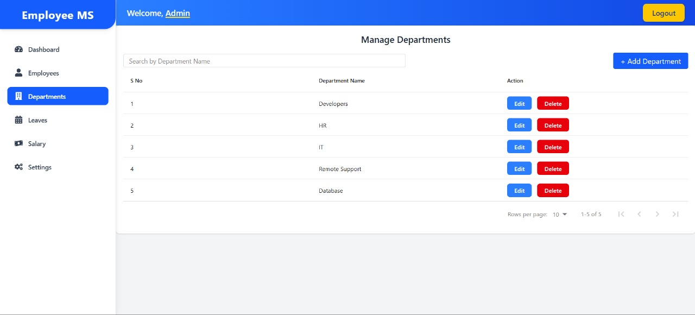
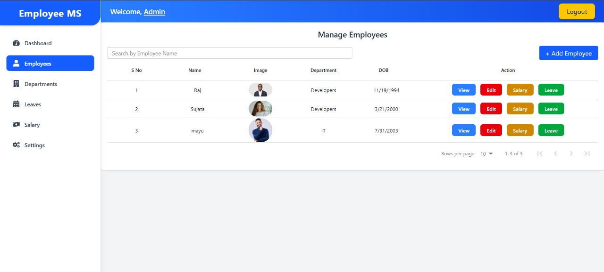

# 🧑‍💼 Employee Management System - PRODIGY_FS_02

This is a full-stack **Employee Management System** built using the **MERN stack** (MongoDB, Express.js, React, Node.js) and styled with **Tailwind CSS**. It features secure authentication, role-based access control, and a responsive user interface to manage employees effectively.

---

## 📌 Features

- 🧾 Employee login
- 🔐 JWT-based authentication
- 🧂 Password hashing with bcrypt
- 🔑 Role-based access control (e.g., Admin/User)
- 🛡️ Protected routes using middleware
- 📊 Employee management interface (Add, View, Delete)
- 🎨 Responsive UI with React + Tailwind CSS


## 🖥️ Tech Stack

### Backend:
- Node.js
- Express.js
- MongoDB (Mongoose)
- JWT (jsonwebtoken)
- bcrypt.js
- dotenv

### Frontend:
- React.js
- Tailwind CSS
- Axios
- React Router DOM


---

## 🚀 Getting Started

### 1. Clone the Repository

```bash
git clone https://github.com/vira250/PRODIGY_FS_02.git
cd PRODIGY_FS_02
```
### Set Up Backend

```bash
cd server
npm install
```
Create a .env file in the server directory:

```bash
PORT=5000
MONGO_URI=your_mongodb_connection_string
JWT_SECRET=your_jwt_secret
```

Start the backend server:

```bash
npm start
```

### Set Up Frontend

```bash
cd fronend
npm install
```
Start the React frontend:

```bash
npm run dev
```

## 📬 API Endpoints (Backend)

| Method | Endpoint             | Description             | Access        |
| ------ | -------------------- | ----------------------- | ------------- |
| POST   | `/api/register`      | Register a new employee | Public        |
| POST   | `/api/login`         | Employee login          | Public        |
| GET    | `/api/employees`     | List all employees      | Admin Only    |
| DELETE | `/api/employees/:id` | Delete an employee      | Admin Only    |
| GET    | `/api/protected`     | Access protected data   | Authenticated |

## UI Screenshots

### Login Page


### Admin Dashboard 


### Departments List


### Employee List


## 🔐 Security

Passwords hashed using bcrypt

JWT used for authentication

Protected routes (User/Admin)

Secure storage of environment variables

## ✨ Future Enhancements

🔁 Forgot Password & Reset Flow

📧 Email Verification

📊 Admin Dashboard

🌐 Deploy on Vercel + Render

## 🙋‍♂️ Author

Viraj Jadhav

## 📣 Contributions

Feel free to fork the project, raise issues, or submit pull requests. All contributions are welcome!

